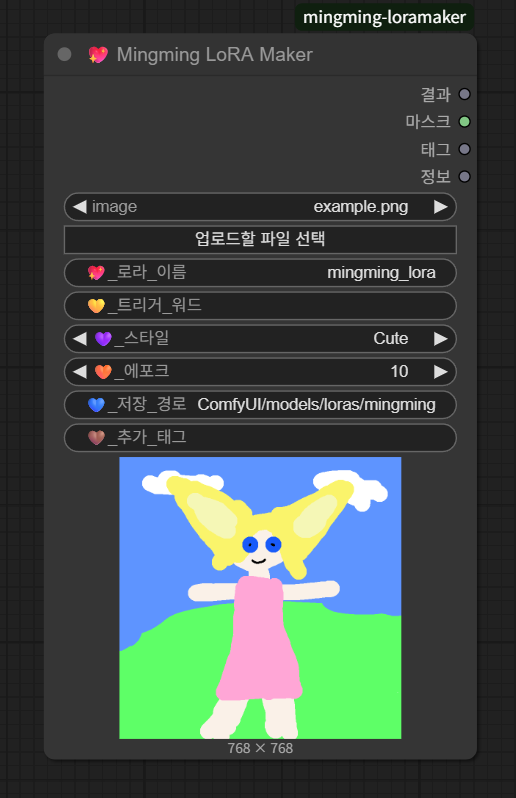

# 💖 Mingming LoRA Maker — 커밍쑨 (WAN 2.2 360° 캐릭터 LoRA 플로우 / Character 360° LoRA Flow)

> 🇰🇷 **설명**: ComfyUI 노드 기반으로 **WAN 2.2**에서 캐릭터를 360°로 회전(앞/뒤/측면/사선)시키며 **LoRA 학습용 데이터셋**을 만드는 워크플로우입니다.  
> 🇺🇸 **Description**: A ComfyUI node workflow using **WAN 2.2** to generate a character in 360° rotation (front/back/side/quarter) and prepare a dataset for **LoRA training**.  
> *현재 문서는 Coming Soon 버전으로, 핵심 사용법과 권장 설정만 우선 공개됩니다.*



---

## ✨ 개요 / Overview

- 🇰🇷 목표: 캐릭터를 다양한 각도에서 생성 → 태그와 파일명 규칙으로 저장 → LoRA 학습에 활용  
- 🇺🇸 Goal: Generate a character from multiple angles → Save with clean tags & filenames → Use for LoRA training  

- 환경 / Environment: **ComfyUI** + **Mingming LoRA Maker** custom node  
- 모델 / Model: **WAN 2.2** (image generation), then fine-tuned into **LoRA**  
- 트리거 토큰 권장 / Recommended Trigger Token: `vyg`  

---

## 🧩 노드 설명 / Node Parameters

| 필드 / Field | 설명 (KR) | Description (EN) |
|---|---|---|
| `image` | 업로드할 원본 이미지 | Input source image |
| `💖 로라_이름` | 결과 LoRA 이름 | LoRA output name |
| `💎 트리거_워드` | LoRA 호출 토큰 | Token for LoRA invocation |
| `💜 _스타일` | 스타일 프리셋 | Style preset (`Cute / Anime / Realistic`) |
| `🧡 _에포크` | 학습 에포크 값 | Epoch value (for training scripts) |
| `💙 _저장_경로` | 출력 저장 경로 | Output save path |
| `🤎 _추가_태그` | 보조 태그 | Additional CSV tags |

> 🇰🇷 저장 시 **각도/포즈/시드 포함 권장** → `vyg_charA_front_0001.png`  
> 🇺🇸 Recommended to include **view/pose/seed in filename** → `vyg_charA_front_0001.png`  

---

## 🎥 데이터 생성 가이드 / Data Generation Guide

- 🇰🇷 각도 분할 예시: `front view`, `quarter view (left)`, `side view (left)`, `back view`, `side view (right)`, `quarter view (right)`  
- 🇺🇸 Recommended views: `front view`, `quarter view (left)`, `side view (left)`, `back view`, `side view (right)`, `quarter view (right)`  

- 프롬프트 예시 / Prompt Example:  
  ```text
  vyg, cute mascot girl, big triangular ears, pink dress, simple flat color style,
  full body, centered composition, plain background, clean edges
  ```

- 네거티브 예시 / Negative Example:  
  ```text
  disfigured, extra limbs, cropped, motion blur, background clutter, watermark, text
  ```

---

## 🗂️ 폴더 구조 / Folder Structure

```
{저장_경로} / {save_path}/
 ├─ images/
 │   ├─ 000_front/
 │   ├─ 010_quarter_left/
 │   ├─ 020_side_left/
 │   ├─ 180_back/
 │   ├─ 340_quarter_right/
 │   └─ 350_side_right/
 ├─ tags/
 │   ├─ images.csv            # 파일명, 태그 / filename, tags
 │   └─ global_tags.txt       # 공통 태그 / global tags
 └─ meta/
     └─ dataset.json          # 선택: 시드/좌표 / optional: seeds/pose info
```

---

## 🏋️ 학습 권장 설정 / Training Recommendations *(Coming Soon)*

- 🇰🇷 **PEFT**: LoRA 또는 DoRA  
- 🇺🇸 **PEFT**: LoRA or DoRA  

- 🇰🇷 네트워크 랭크: 8~16  
- 🇺🇸 Network rank: 8~16  

- 🇰🇷 학습률: `5e-5` ~ `1e-4`  
- 🇺🇸 Learning rate: `5e-5` ~ `1e-4`  

- 🇰🇷 태그: `vyg` + 캐릭터 핵심 속성  
- 🇺🇸 Tags: `vyg` + core character attributes  

---

## ⚙️ ComfyUI 플로우 요약 / ComfyUI Flow Summary

1. 🇰🇷 WAN 2.2 체크포인트 로드 → 프롬프트 구성 → 배치 생성 → LoRA Maker 저장  
2. 🇺🇸 Load WAN 2.2 checkpoint → Setup prompts → Batch generation → Save with LoRA Maker  

> 예시 프롬프트 세트와 JSON은 곧 공개됩니다. / Example prompt sets & JSON will be released soon. **Coming Soon!**

---

## 🔖 라이선스 & 크레딧 / License & Credits

- 🇰🇷 모델 및 데이터셋의 저작권 준수는 사용자 책임  
- 🇺🇸 Users are responsible for respecting model/dataset licenses  

---

## ❓FAQ

- Q. 🇰🇷 `__pycache__` 폴더 지워도 되나요?  
     🇺🇸 Can I delete the `__pycache__` folder?  
  - A. 🇰🇷 네, 지워도 안전하며 필요 시 다시 생성됩니다.  
       🇺🇸 Yes, it's safe to delete. Python will regenerate it if needed.  

- Q. 🇰🇷 트리거 토큰은 꼭 필요한가요?  
     🇺🇸 Do I really need a trigger token?  
  - A. 🇰🇷 캐릭터 호출 안정성을 위해 강력히 권장합니다 (`vyg` 등).  
       🇺🇸 Strongly recommended for character consistency (e.g., `vyg`).  

---

## 📬 문의 / Updates

- 🇰🇷 업데이트 예정: 프롬프트 프리셋, JSON 플로우, 학습 스크립트  
- 🇺🇸 Upcoming: Prompt presets, workflow JSON, training scripts  

**커밍쑨! / Coming Soon!**
